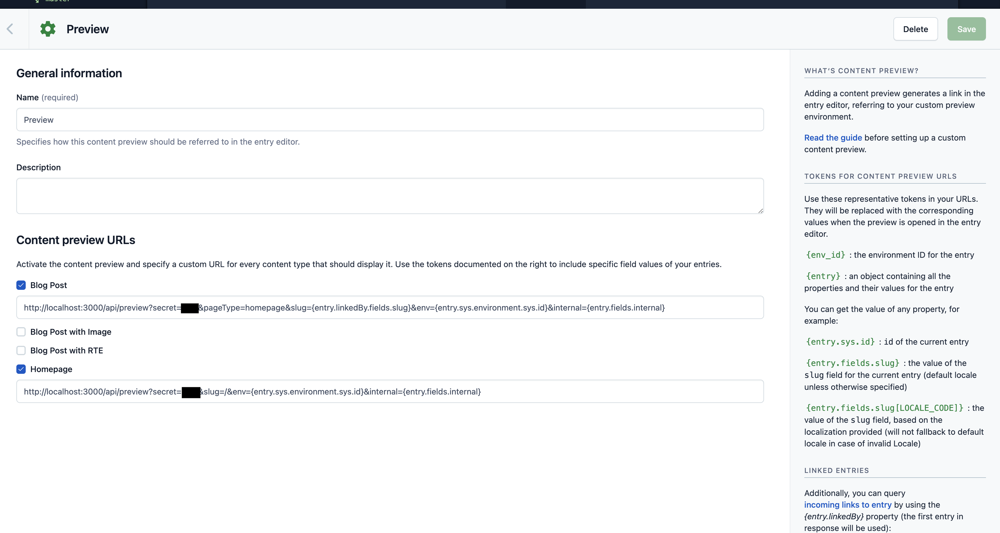
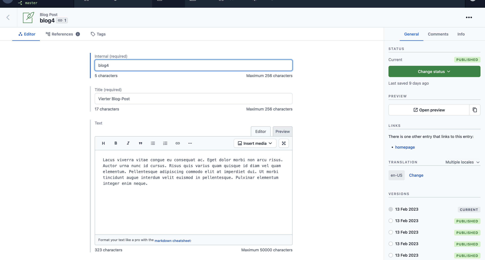
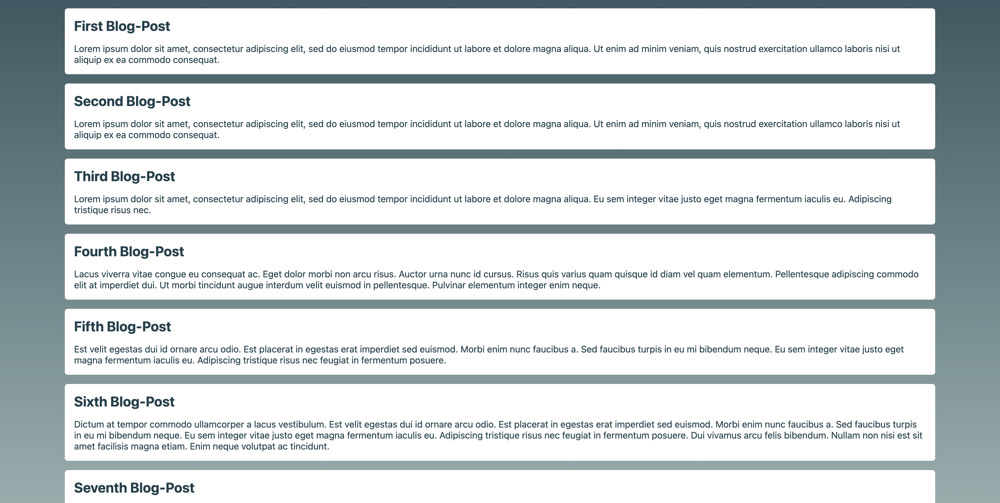
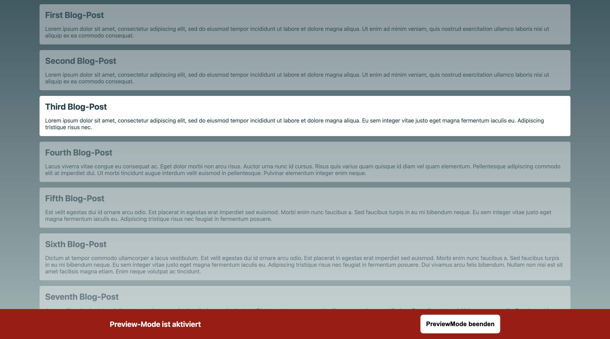
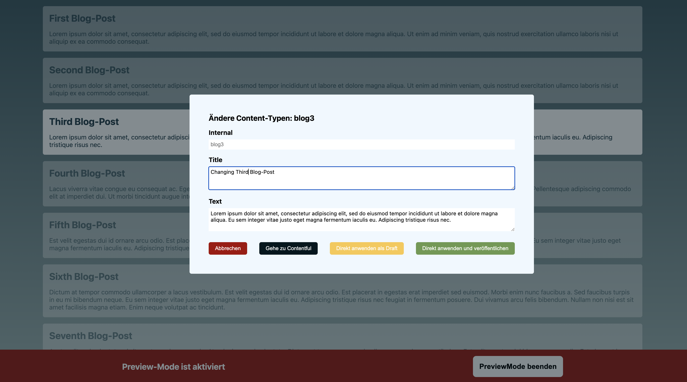

## Workflow Example

Just as a reminder: You have to setup the preview-urls correclty.

### Your preview setup

You find hints how to do it in the package readme. So your urls should look something like this:

### Your editors experience

You can press the "open-preview"-Button in your contentful-space.

The preview will be opened like you know it.

With pressing **"Command"** + **"Option"** + **"S"** your editor can activate the preview-Mode.

If your editor clicks on any entry that comes from contentful, there will be a modal popping up.

#### Editors options

You see there are several options your editors can choose from:

**Go To Contentful:** Redirect to the specific entry in contentful.
**Apply as draft:** Changes will be handled as a draft (you see the changes, but they are not published yet)
**Apply and publish:** Changes will be published directly.

The changes will be applied and the page will be refreshed. The changes are now visible without the need to navigate to contentful.
